# Spotify's Aesthetic: A UI Journey Through Spotify and Spotify Wrapped

I found myself once again immersed in the melodic embrace of Spotify, navigating its intricate interface that seems to understand my musical personality. I’m always interacting with Spotify's UX design and it's a journey of seamless interaction and delightful discovery. For years, I've resisted the urge to venture into the realms of other platforms like Apple Music, or Youtube music, not because of a lack of features or content, but because, quite frankly, everything else seems to pale in comparison when it comes to visual charm. The goals were clear: relive the musical highlights of the past year in a visually engaging and emotionally resonant manner.

<h3>Heutristic Importance</h3>

Heuristic's are crucial because it directly impacts the user experience by minimizing cognitive load and enhancing usability. Here's why it holds significant importance:

Reduced Cognitive Load:

Ease of Use - Users prefer interfaces that don't burden their memory. Recognition allows them to effortlessly identify and use features without the need to recall specific steps, reducing mental effort.

Efficiency and Learnability:

Adaptability - Interfaces that rely on recognition are more efficient and learnable. Users can quickly adapt to the system, leading to a smoother and more enjoyable user experience.

Preference for Familiarity:

User Comfort - Familiar interfaces foster user comfort. Users are naturally drawn to platforms that feel familiar, where they don't have to expend effort understanding new interactions each time they use the system.

User Confidence:

Sense of Control - Recognition instills confidence in users. When they can easily identify and use features, it enhances their sense of control and mastery over the platform, contributing to a positive overall experience.

User Loyalty - Consistent Experience: Platforms that consistently follow this heuristic tend to build user loyalty. Users are more likely to stick with a platform that provides a reliable, recognizable, and user-friendly experience over time.

In essence, the Recognition rather than Recall heuristic is important because it aligns with fundamental user preferences for simplicity, familiarity, and a reduced cognitive burden. Platforms that prioritize this heuristic tend to offer a more satisfying and user-centric experience, leading to increased user retention and loyalty.

<H3>Goals</H3>

My primary goal was to understand how well Spotify Wrapped facilitated the journey of reliving my musical highlights and whether it effectively communicated my musical story.

<H3>Description of Interaction</H3>

As the day began, I instinctively opened the Spotify app, greeted by a homepage that felt like a curated portal to my musical haven. The personalized playlists and recommendations were laid out like a musical tapestry, inviting me to explore genres, artists, and moods tailored precisely to my taste. The intuitive design made it effortless to dive into the day's soundtrack, a testament to Spotify's commitment to personalization and accessibility.

A notification beckoned me to explore my Wrapped experience. The entry point was seamless, with a visually appealing banner drawing my attention. As I clicked through, a series of visuals greeted me—starting with a vibrant display of genres, followed by geographic insights, top songs, total listening minutes, and a spotlight on the artists who colored my year.

The interactive journey allowed me to delve deeper into each category, revealing monthly breakdowns, personalized playlists, and even a Listening Personality test—a surprise addition that added a delightful twist to the experience.

<H3>Outcome</H3>

The outcome was a captivating visual narrative that went beyond the numbers. Spotify Wrapped succeeded in not only presenting statistics but transforming them into a personalized, emotionally resonant journey. The experience was effective in achieving my goal of reliving the musical highlights, providing a visually engaging and accessible interface for exploration.

**Assessment of UX Concepts:**

**Learnable:**

Strength: The navigation through Spotify Wrapped was intuitive, leveraging familiar symbols and cues. Each section seamlessly led to the next, requiring minimal effort to understand the app's structure.

**Memorable:** 

Strength: Visual elements, such as vibrant color schemes and animated graphics, contributed to a memorable experience. The surprise factor of the Listening Personality test added a memorable and enjoyable twist.
Weakness: The monthly breakdowns, while comprehensive, could benefit from more visually distinctive elements to enhance memorability.

**Satisfying:**

Strength: Emotional resonance was a significant achievement. Personalized insights, especially the top songs and artists, fostered a sense of connection and ownership, contributing to a satisfying experience.
Weakness: Limited prominence of the monthly breakdowns might leave some users wanting a more comprehensive exploration, potentially affecting overall satisfaction.

**Suggestions:**

Provide brief tooltips or explanations for new features to enhance clarity.
Include a prominent link to access detailed monthly breakdowns for users who wish to explore their musical journey more comprehensively.
*In conclusion, Spotify Wrapped proved to be more than a feature—it was a UX journey that seamlessly blended aesthetics, emotion, and functionality. As I eagerly await the next musical chapter, the usability and user experience excellence of Spotify Wrapped remain a benchmark in the realm of interactive and visually compelling digital experiences. Cheers to the music and the magic of user-centric design!

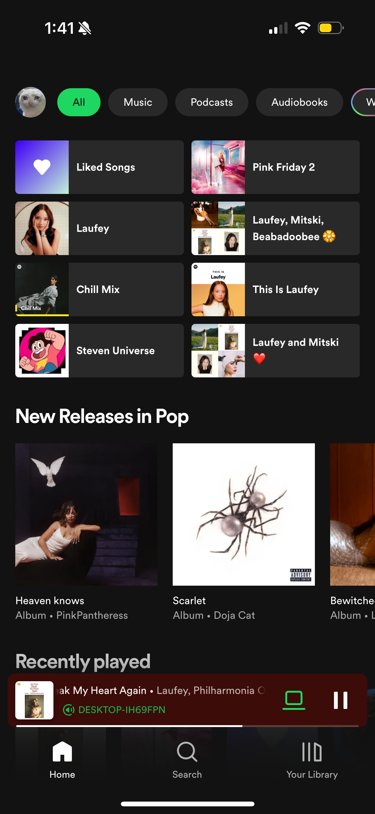

<H3>Discovering Daily Mixes:</H3>

A highlight of my day unfolded with the introduction of my Daily Mixes—a personalized medley of genres that Spotify intuitively knew would resonate with my current mood. The seamless integration of this feature showcased the platform's commitment to learnability and adaptability. Each mix felt like a carefully crafted playlist, a musical companion guiding me through the day's diverse sonic landscapes.

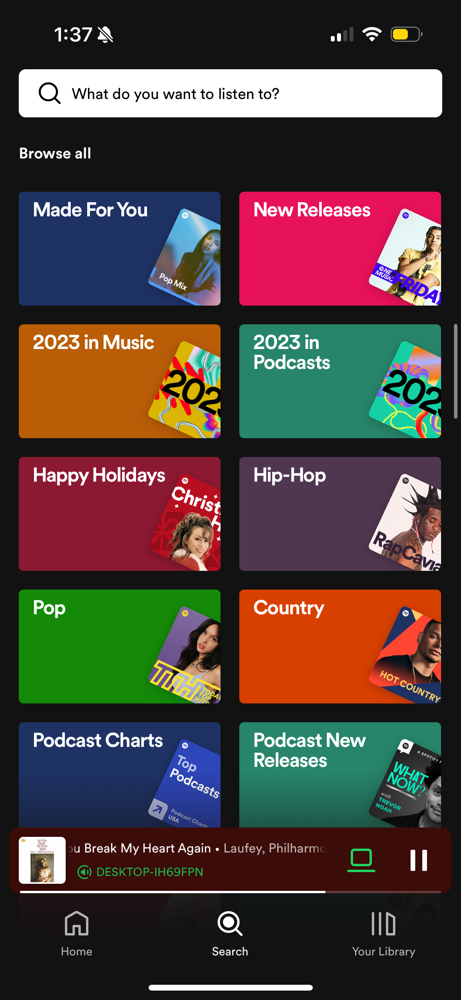

<H3>Effortless Exploration:</H3>

Navigating through the app felt like a rhythmic flow. The bottom navigation bar, adorned with familiar icons for Home, Search, Your Library, and Premium, served as my compass in this musical journey. Whether I sought the comfort of my saved library or ventured into the vast world of new releases, the UX design facilitated an effortless exploration. It's a testament to the simplicity that amplifies the efficiency of navigation, making my daily interaction with Spotify a joyous ritual.

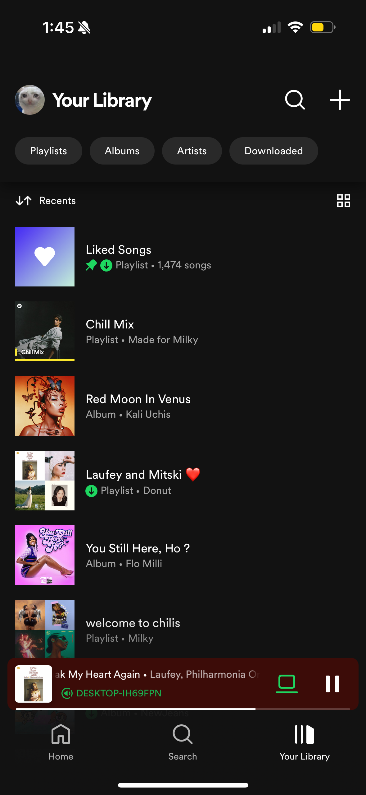

<H3>Anticipation Builds:</H3>

Every year I’m excited for Spotify Wrapped, an annual ritual that adds a layer of excitement to the end of the year. The anticipation was not just about the numbers but about revisiting the memories associated with each song, reliving the emotions they evoked, and celebrating the diversity of my musical taste. Wrapped became a joyful part of the new year for me, its like a personal celebration marking the culmination of my year in music.

<h3>Spotify Wrapped Unveiled:</h3>

As the day drew to a close, I eagerly opened Spotify to witness the unveiling of my Wrapped. The UX design transformed data into a visual narrative, a story of my year in music. Animated graphics and personalized statistics guided me through a visually compelling journey, making the experience not just informative but truly enjoyable. The interactivity allowed me to delve into specific categories, creating a sense of agency in my exploration. It wasn't just a list of statistics. It was an interactive and exploratory adventure. As I eagerly embarked on the annual ritual of unwrapping my Spotify Wrapped, the platform gracefully unfolded a visual symphony of musical insights that transcended mere statistics. The journey commenced with a mesmerizing display of the genres that had colored my year in music, a kaleidoscope of sonic diversity that reflected the myriad facets of my musical taste.

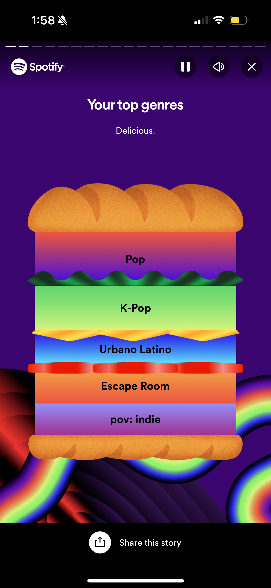

The revelation that Berkeley, USA, shares a harmonious affinity with my musical preferences added a delightful layer of connection. It was a testament to Spotify's ability to not only curate my individual taste but also place me within a broader community of like-minded music enthusiasts, a virtual musical neighborhood where borders dissolve, and melodies become a universal language.

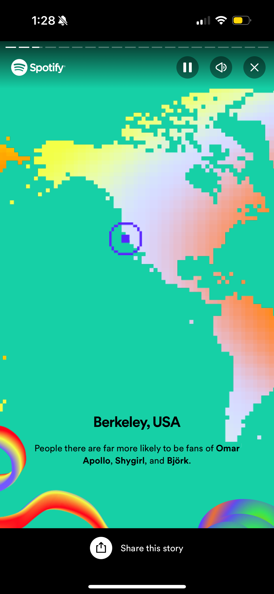

The crescendo of insights continued as Spotify Wrapped unveiled the sheer magnitude of my musical exploration. I have listened to over 3969 songs this year. I traversed a testament to the richness of the Spotify library that kept me endlessly curious.

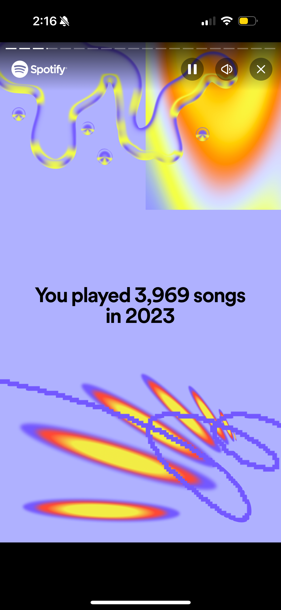

Then, the spotlight shifted to the true stars of my auditory journey, the top songs that had etched themselves into the fabric of my year. Each track was not just a song. It was a timestamp, a sonic memory encapsulating moments, moods, and emotions. Spotify Wrapped visual presentation elevated these songs from a mere list to a gallery of personal musical milestones.

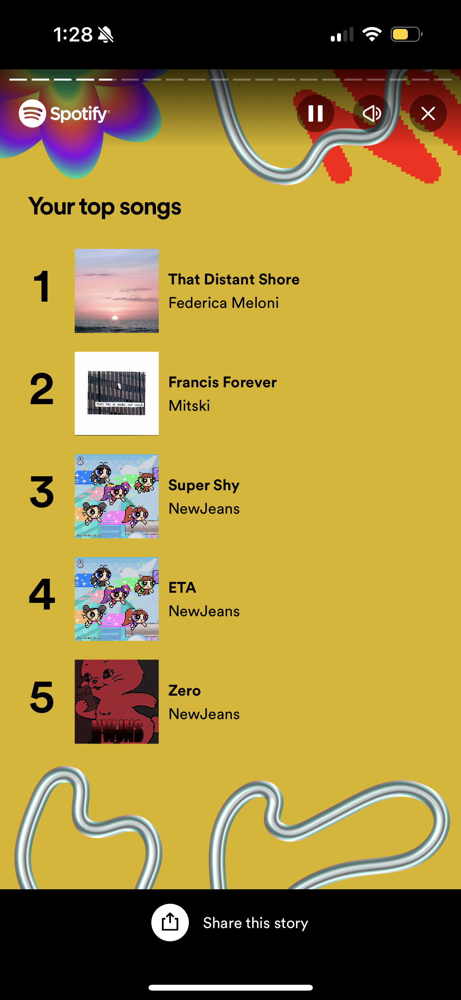

The revelation that I had indulged in a staggering 65,585 minutes of musical bliss was a delightful shock, a testament to the role music played as the soundtrack to my life. The minutes transformed into more than just a statistic. They became a measure of the time spent in the company of melodies, a reflection of the joyous escapades and introspective moments that unfolded throughout the year.

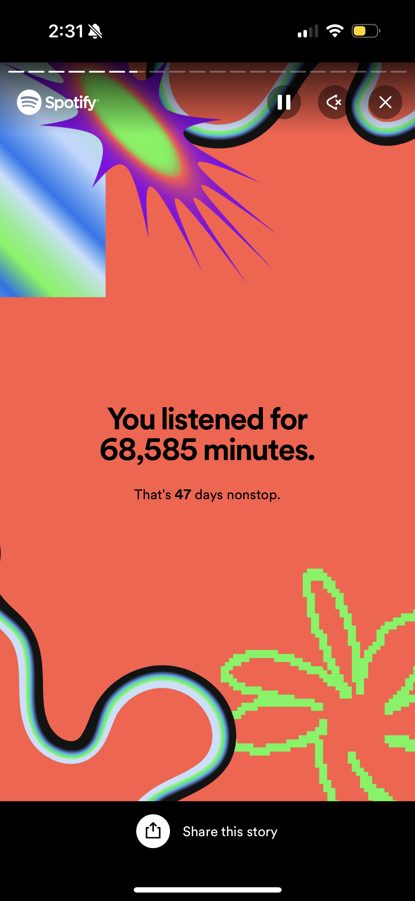

I’ve listened to over 2,002 artists this year ,but one came out on top. As the curtain lifted on the multitude of artists who graced my auditory landscape, NewJeans emerged as the maestro, claiming the top spot with an impressive 3,266 minutes. It was a moment of recognition, not just for the artist but for the impact their music had on my year. Spotify Wrapped ability to highlight these musical protagonists added a personal touch, transforming numerical data into a celebration of artistic influence.

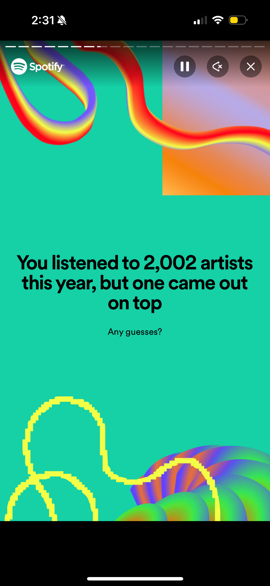

The monthly breakdown of each artist was the grand finale, a visual journey through the ebb and flow of my musical preferences. It was a kaleidoscopic exploration, revealing the evolving chapters of my auditory tale. Each artist, like a character in a novel, played a distinct role in shaping the narrative of my musical journey.

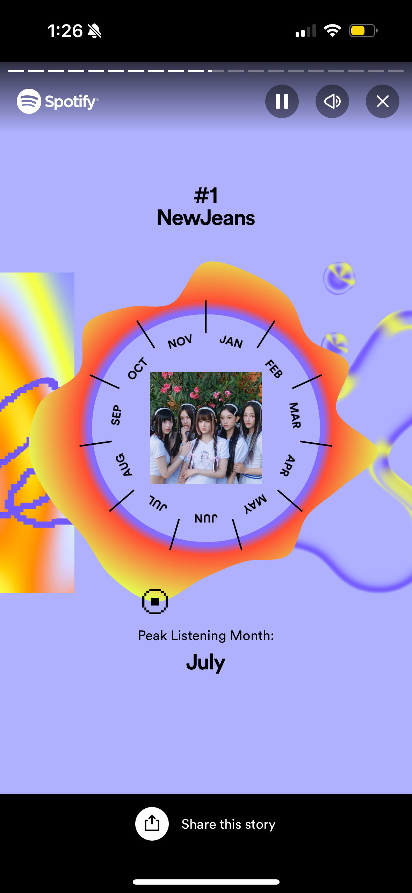
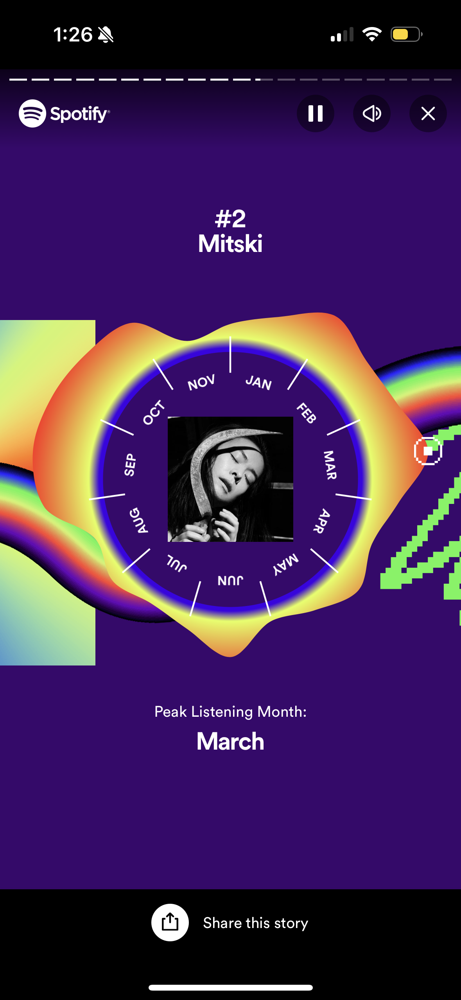
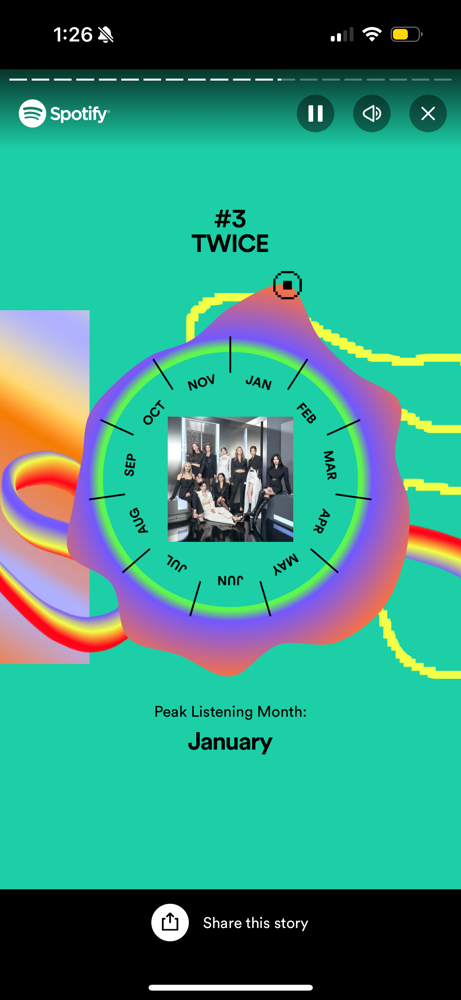

In the grand orchestra of Spotify Wrapped, these revelations weren't just numbers and charts. They were visual notes composing a personalized symphony. Each insight became a brushstroke on the canvas of my year, creating a visual masterpiece that celebrated the diversity, connectivity, and sheer joy that music brought into my life. Spotify Wrapped wasn't just a recap. It was a visual ode to the magic of music, a testament to the platform's ability to turn data into a vibrant and resonant visual journey.

<h3>Sharing the Musical Journey:</h3>

The social sharing brilliance of Spotify Wrapped added a communal layer. Effortlessly integrating with various social media platforms, it turned individual revelations into shared conversations. Posting my Wrapped results on Instagram became a social event, an invitation for followers, friends, and fellow music enthusiasts to engage in a dialogue about the year's musical highlights. The sociable aspect extended beyond the digital realm, sparking real conversations about shared tastes, discoveries, and the emotional journeys attached to specific songs.

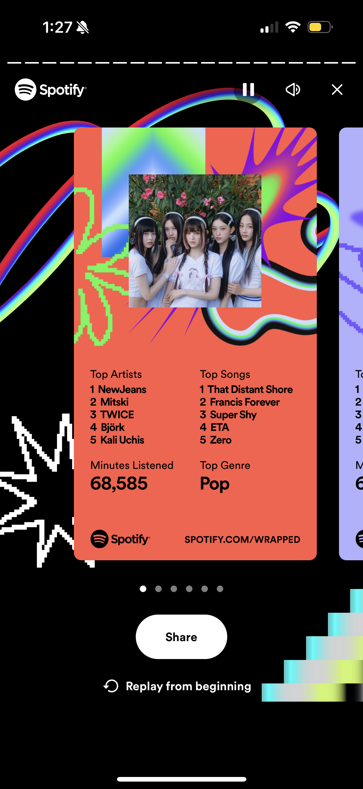
